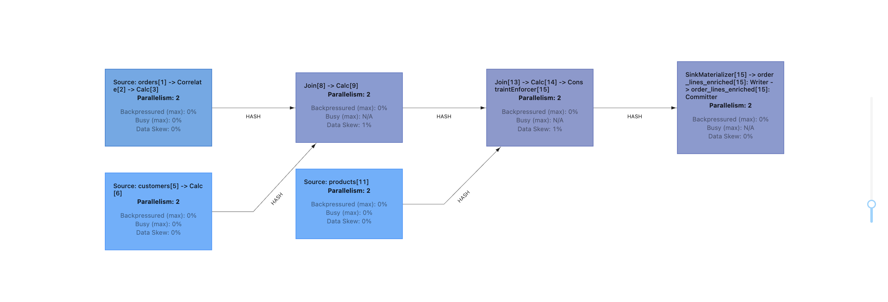
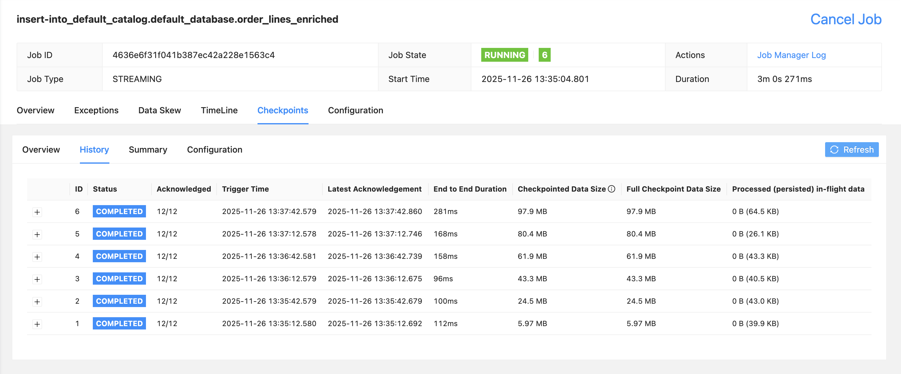
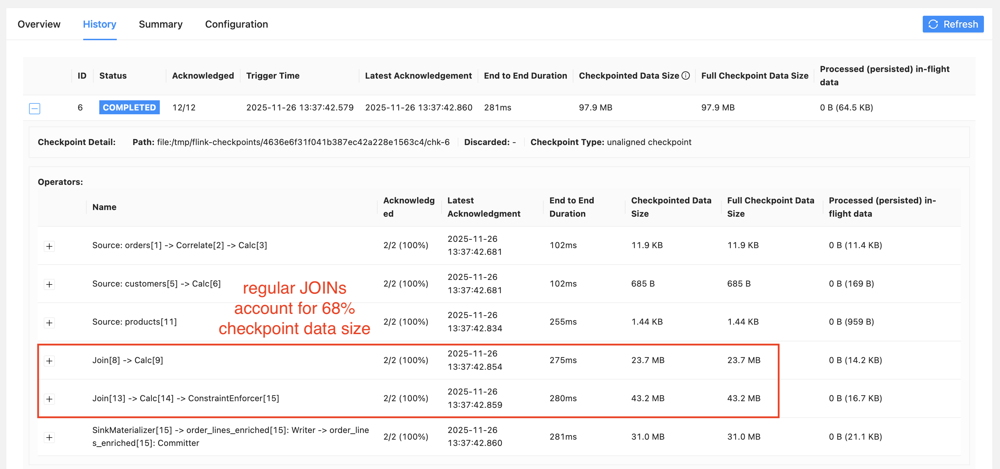
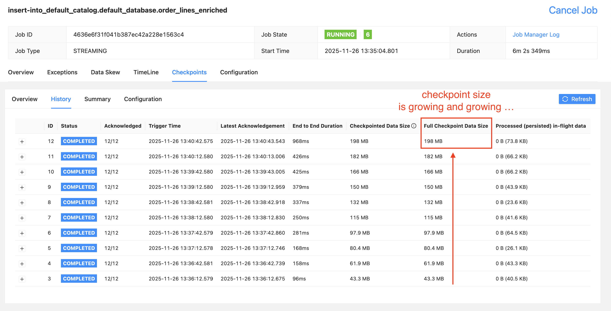
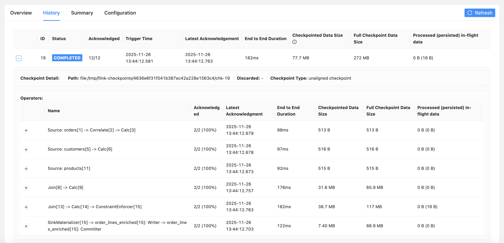
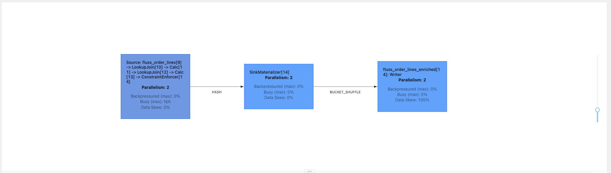
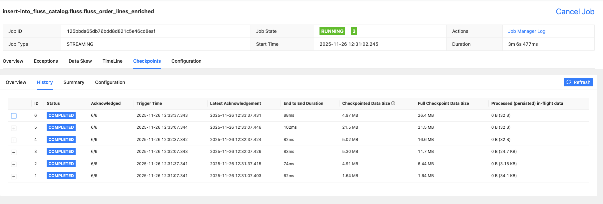
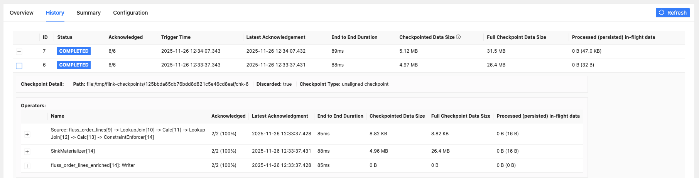
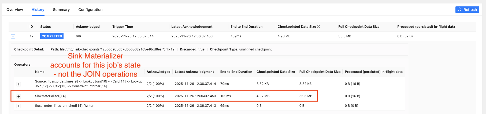
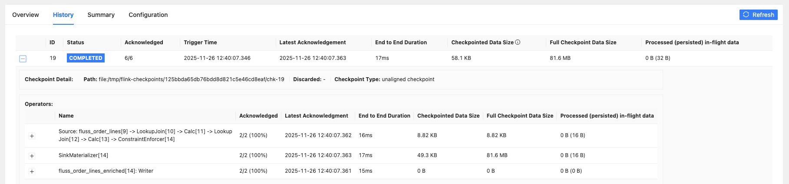

# Fluss Streaming Storage and Lookup `JOIN`s with Flink

This repository hosts an exemplary data streaming scenario to understand the fundamental state-related differences between **regular vs. lookup `JOIN`s in Flink** jobs. The following three streams of data, all originating from Apache Kafka topics, are involved:

* **customers**

```json5
//sample payload
{
  "id": "2d147101-1581-9762-d4cd-a55d7d6da065",
  "name": "Albert Mosciski",
  "direct_subscription": false,
  "membership_level": "elite",
  "shipping_address": "Suite 681 730 Rochel Underpass, Lake Florentino, KS 13093",
  "activation_date": "2022-07-29T07:46:55.693+00:00"
}
``` 

* **products**

```json5
//sample payload
{

  "id": "6d371be1-c0ee-0ad6-c19c-cd9d211c41a1",
  "name": "Awesome Iron Hat",
  "brand": "Adidas",
  "vendor": "Dollar General",
  "price": 81.91
}
``` 

* **orders**

```json5
//sample payload
{
  "id": "c5d7e8e4-a963-b427-3051-b8273c502158",
  "customer_id": "2d147101-1581-9762-d4cd-a55d7d6da065",
  "notes": "Quia tempora aliquid inventore. Magnam ullam porro quos nisi itaque maiores non. Corporis voluptatem quo hic excepturi unde dolores. Numquam sapiente quidem assumenda maiores.",
  "create_ts": 1764160589689,
  "creditcard": "6759-5294-9474-0918",
  "discount_percent": 5,
  "order_lines": {
    "6d371be1-c0ee-0ad6-c19c-cd9d211c41a1": 3,
    "b9548034-6512-32bc-e4ed-3342ae1484eb": 13,
    "c151a3ae-ab30-c574-a508-1e3c1b67f097": 8
  }
}
```

For each of the three entities, continuous events - respecting the referential integrity between orders and customers as well as order lines and products - are simulated using [shadowtraffic](https://shadowtraffic.io).

## Baseline Setup

### Prerequisites

Before you can run the full example as described below on your machine, you need to grab your _free personal licence key for shadowtraffic_ [here](https://shadowtraffic.io/pricing.html) and put it into [this file](./st/license.env) according to the [instructions](https://docs.shadowtraffic.io/quickstart/#create-a-license-file) in the documentation.

Once this is set up, switch to a terminal window, make sure you are in the root folder of this repository, and launch all containers by running 

```bash
docker compose up
```

Give it a few moments. Eventually, you should have a total of seven containers up and running:

```bash
CONTAINER ID   IMAGE                                                 COMMAND                  CREATED              STATUS              PORTS                                         NAMES
963581506f58   apache/fluss:0.8.0-incubating                         "/docker-entrypoint.…"   About a minute ago   Up About a minute                                                 flink-fluss-demo-02-tablet-server-1
6d45c46a3250   apache/fluss-quickstart-flink:1.20-0.8.0-incubating   "/docker-entrypoint.…"   About a minute ago   Up About a minute   6123/tcp, 8081/tcp                            flink-fluss-demo-02-taskmanager-1
4d6360a43fc0   apache/fluss:0.8.0-incubating                         "/docker-entrypoint.…"   About a minute ago   Up About a minute                                                 flink-fluss-demo-02-coordinator-server-1
783bbeac9e11   shadowtraffic/shadowtraffic:1.11.11                   "java -Djava.securit…"   About a minute ago   Up About a minute                                                 flink-fluss-demo-02-shadowtraffic-1
8dca1c56553a   apache/fluss-quickstart-flink:1.20-0.8.0-incubating   "/docker-entrypoint.…"   About a minute ago   Up About a minute   0.0.0.0:8081->8081/tcp, [::]:8081->8081/tcp   flink-fluss-demo-02-jobmanager-1
0e0e490b5985   quay.io/strimzi/kafka:0.47.0-kafka-4.0.0              "sh -c './bin/kafka-…"   About a minute ago   Up About a minute   0.0.0.0:9092->9092/tcp, [::]:9092->9092/tcp   flink-fluss-demo-02-kafka-1
76ebf85b0694   zookeeper:3.9.2                                       "/docker-entrypoint.…"   About a minute ago   Up About a minute   2181/tcp, 2888/tcp, 3888/tcp, 8080/tcp        flink-fluss-demo-02-zookeeper-1
```

One of them runs _shadowtraffic_ to synthetically generate all event payloads in the background - in total `250000` records spanning across the three Kafka topics (`ecom_customers`, `ecom_products`, `ecom_orders`) involved. The configuration details can be found in [data_generator.json](./st/data_generator.json)

## Scenario 1: Kafka Ingest and Regular `JOIN`s in Flink

### Flink SQL Job Description

The Flink SQL job serving as object of study for regular `JOIN`s is defined as follows:

```sql
INSERT INTO order_lines_enriched
SELECT 
    o.id AS order_id,
    c.id AS customer_id,
    c.name AS customer_name,
    c.membership_level,
    c.shipping_address,
    o.notes,
    o.create_ts AS order_datetime,
    o.creditcard AS creditcard,
    o.discount_percent,
    ol.product_id,
    ol.items AS quantity,
    p.name AS product_name,
    p.brand,
    p.vendor,
    p.price AS unit_price,
    ROUND((p.price * ol.items),2) AS line_subtotal,
    ROUND((p.price * ol.items * (100 - o.discount_percent) / 100),2) AS line_total_discounted    
FROM orders AS o
CROSS JOIN UNNEST (order_lines) AS ol(product_id, items)
LEFT JOIN customers AS c
    ON o.customer_id = c.id
LEFT JOIN products AS p
    ON ol.product_id = p.id;
```

It reads the stream of incoming `orders`, flattens the order's line items by means of `CROSS JOIN UNNEST`, does a first regular `LEFT JOIN` with `customers`, and a second regular `LEFT JOIN` against `products`. The outcome of this is a decomposed order for which all line items have been enriched by additional information.

The resulting rows for one specific, original input `order` record could look like so:

```bash
                       order_id                    customer_id                  customer_name               membership_level               shipping_address                          notes            create_ts                     creditcard discount_percent                     product_id    quantity                   product_name                          brand                         vendor                     unit_price                  line_subtotal          line_total_discounted
 6ed6ae05-8395-c005-7fd3-541b6~ 9b8a5188-d320-cd53-197f-030d2~                  Elvis Kilback                           free Suite 153 1004 David Lodge, O~ Fuga labore beatae iste saepe~        1764104664426            6762-8206-4774-4347                6 c8df0188-11bb-91dc-024a-261ca~           8     Incredible Rubber Computer                           Dell                         Target                           8.05                           64.4                          60.54
 6ed6ae05-8395-c005-7fd3-541b6~ 9b8a5188-d320-cd53-197f-030d2~                  Elvis Kilback                           free Suite 153 1004 David Lodge, O~ Fuga labore beatae iste saepe~        1764104664426            6762-8206-4774-4347                6 1e7cfa4e-3a04-0d2c-2af0-6ace2~          14           Gorgeous Steel Plate                           Nike                 Dollar General                          71.72                        1004.08                         943.84
 6ed6ae05-8395-c005-7fd3-541b6~ 9b8a5188-d320-cd53-197f-030d2~                  Elvis Kilback                           free Suite 153 1004 David Lodge, O~ Fuga labore beatae iste saepe~        1764104664426            6762-8206-4774-4347                6 990deeab-7453-0b3f-7b18-2d867~           3            Rustic Concrete Car                             LG                         Amazon                          35.71                         107.13                          100.7

```

### Flink SQL Job Execution

There is a convenient script which allows you to execute all the necessary [DDL](./data/flink/sql/kafka_ingest_ddl.sql) + [DML](./data/flink/sql/kafka_ingest_dml.sql) statements required to launch this Flink SQL job. From the root folder of this repository run

```bash
docker compose exec jobmanager /opt/sql-client/sql/kafka-ingest-run.sh
```

### Flink SQL Job Inspection

Let this job run for a couple of minutes, then proceed to the [Flink Web Dashboard](http://localhost:8081/#/job/running) which shows the running job. Click on it to dig a little deeper:

1. The Flink job graph for the SQL query above looks like this:



2. If you switch to the *Checkpoints* tab and then choose *History*, you should be able to see a few completed checkpoints. The screenshot below was taken at about three minutes into running this job:



It shows that checkpoint size is increasing fast over time as new data arrives for processing. Even for this toy example we have already about `100 MB` in total. By drilling into the details we can see that due to the regular `JOIN` operations, these operators accrue state which can become significant over time.



3. Wait another few minutes to verify this keeps growing and growing indeed and makes a noticeable difference as you are going to see later in scenario 2.




4. After about nine minutes into the job - the moment when all `250k` simulated events have been processed - we see that the checkpoint results have stabilized. If we do some quick math, we can conclude that **the majority i.e. about two thirds (`68%`) or `~183 MB` of the checkpoing size is induced by the two regular `JOIN` operations.**



**! The larger the key space gets over time for either of the JOIN tables involved, the more state will accrue. This is an unfavorable consequence of running regular `JOIN`s in Flink and should be avoided for effectively unbounded key spaces as much as possible !**

## Scenario 2: Fluss Ingest and Lookup `JOIN`s in Flink

Let's contrast what we just witnessed with a different version of this job that uses lookup `JOIN`s and is sourced directly from the Fluss-backed tables.

### Flink SQL Job Description

The Flink SQL job serving as object of study for **lookup `JOIN`s** is defined as follows:

```sql
INSERT INTO fluss_order_lines_enriched
SELECT 
    ol.id AS order_id,
    c.id AS customer_id,
    c.name AS customer_name,
    c.membership_level,
    c.shipping_address,
    ol.notes,
    ol.create_ts AS order_datetime,
    ol.creditcard AS creditcard,
    ol.discount_percent,
    p.id AS product_id,
    ol.items AS quantity,
    p.name AS product_name,
    p.brand,
    p.vendor,
    p.price AS unit_price,
    ROUND((p.price * ol.items),2) AS line_subtotal,
    ROUND((p.price * ol.items * (100 - ol.discount_percent) / 100),2) AS line_total_discounted    
FROM fluss_order_lines ol
LEFT JOIN fluss_customers FOR SYSTEM_TIME AS OF ol.proc_time AS c
    ON ol.customer_id = c.id
LEFT JOIN fluss_products FOR SYSTEM_TIME AS OF ol.proc_time AS p
    ON ol.product_id = p.id;
```

It reads the stream of `fluss_order_lines` (flattened during ingest already), does a lookup `LEFT JOIN` with `fluss_customers`, followed by another lookup `LEFT JOIN` against `fluss_products`. The outcome of this is a decomposed order for which all individual line items have been enriched by additional information.

The resulting rows for one specific, original input `order` record could look like so:

```bash
                       order_id                    customer_id                  customer_name               membership_level               shipping_address                          notes            create_ts                     creditcard discount_percent                     product_id    quantity                   product_name                          brand                         vendor                     unit_price                  line_subtotal          line_total_discounted
 6ed6ae05-8395-c005-7fd3-541b6~ 9b8a5188-d320-cd53-197f-030d2~                  Elvis Kilback                           free Suite 153 1004 David Lodge, O~ Fuga labore beatae iste saepe~        1764107567809            6762-8206-4774-4347                6 990deeab-7453-0b3f-7b18-2d867~           3            Rustic Concrete Car                             LG                         Amazon                          35.71                         107.13                          100.7
 6ed6ae05-8395-c005-7fd3-541b6~ 9b8a5188-d320-cd53-197f-030d2~                  Elvis Kilback                           free Suite 153 1004 David Lodge, O~ Fuga labore beatae iste saepe~        1764107567809            6762-8206-4774-4347                6 c8df0188-11bb-91dc-024a-261ca~           8     Incredible Rubber Computer                           Dell                         Target                           8.05                           64.4                          60.54
 6ed6ae05-8395-c005-7fd3-541b6~ 9b8a5188-d320-cd53-197f-030d2~                  Elvis Kilback                           free Suite 153 1004 David Lodge, O~ Fuga labore beatae iste saepe~        1764107567809            6762-8206-4774-4347                6 1e7cfa4e-3a04-0d2c-2af0-6ace2~          14           Gorgeous Steel Plate                           Nike                 Dollar General                          71.72                        1004.08                         943.84
```

### Flink SQL Job Execution

There is a convenient script which allows you to execute all the necessary [DDL](./data/flink/sql/fluss_ingest_ddl.sql) + [DML](./data/flink/sql/fluss_ingest_dml.sql) statements required to launch this Flink SQL job. From the root folder of this repository run

```bash
docker compose exec jobmanager /opt/sql-client/sql/fluss-ingest-run.sh
```

### Flink SQL Job Inspection

Let this job run for a couple of minutes, then proceed to the [Flink Web Dashboard](http://localhost:8081/#/job/running) which shows the running jobs. Click on the job that performs the enrichment (named `insert-into_fluss_catalog.fluss.fluss_order_lines_enriched`) to dig a little deeper.

1. The Flink job graph for the SQL query discussed above looks like this:



2. If you switch to the *Checkpoints* tab and then choose the *History* tab, you should be able to see a few completed checkpoints already which are performed every `30s` based on this job's configuration. The screenshot below was taken at about three minutes into running the job:



By drilling into the latest checkpoint details, it becomes apparent that there is basically no checkpoint data induced by the two lookup `JOIN`s. The only actual and worth mentioning state in this case comes from the Sink Materializer itself and at this point in time, it is unsuprisingly roughly the same (`~89 MB`) as for scenario 1.



3. Wait a few more minutes to verify the **lookup `JOIN` state stays effectively zero over time**. As expected for this job, only the Sink Materializer state is growing. The screenshot below was taken at about six minutes after starting the job:



4. After about nine minutes - the moment when all `250k` simulated events have been processed - we see the finally stabilized checkpoint results, as no new data is being processed any longer. **Essentially zero Flink state for the two lookup `JOIN`s themselves all the way through.**



